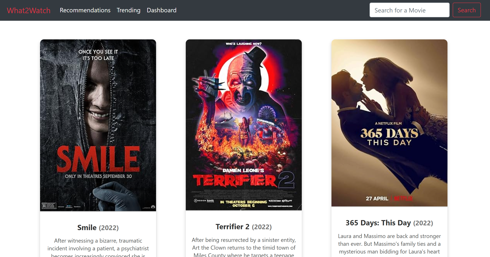

# What2Watch WebApp

Movie recommendation webapp built with Flask based on the [MovieLens](https://grouplens.org/datasets/movielens/) dataset made as part of the Accelerated Introduction to Machine Learning offered by Mcgill's Artificial Intelligence Society.

The application allows users to:

- **Register and Log In**: Users can create an account or log in to an existing one.
- **View Movie Recommendations**: Based on their ratings, users receive personalized movie recommendations.
- **Search for Movies**: Users can search for specific movies by title.
- **Rate Movies**: Users can rate movies they've watched, which helps improve future recommendations.
- **View Trending Movies**: Users can see a list of trending movies (Only up to 2022).

## Machine Learning Model

The webapp makes recommendations based on a collaborative filtering machine learning model using Singular Value Decomposition (SVD). The model predicts user preferences for movies based on the ratings from all users. The model was trained with the [MovieLens32M](https://grouplens.org/datasets/movielens/) dataset.

## Installation

Note you only need the `code/flask webapp` directory to replicate the project.

### Prerequisites

- Python 3.x
- See `requirements.txt` for all needed libraries
- MySQL database
- API keys for [OMDb](https://www.omdbapi.com/) and [TMDb](https://developer.themoviedb.org/reference/intro/getting-started) (for fetching movie data)

### Steps

1. **Clone the repo**
2. **Install Dependencies**
   `pip  install  -r  requirements.txt`
3. **Set Up Environment Variables**

   Create a `.env` file in the root directory and add the following:

   - FLASK_SECRET_KEY : your own secret key
   - DB_URL: the url for your MySQL database
   - TMDB_BEARER: TMDB bearer api token
   - OMDB_API_KEY: your OMDB api key

4. **Run the Application**
   Either using `flask run` or `python run.py`

## Project Structure of the `code` directory

- **flask webapp**
  - **app/**
    - **routes/**: app routes
    - **templates/**: HTML templates for rendering pages.
    - **models/**: SqlAlchemy database models for users, movies, and ratings.
    - **services/**: Contains services for handling business logic.
  - **scripts/**: All communication with the database as well as model re-training
  - **ml_model/**: Stores the machine learning model (and it's backups if needed)
  - **requirements.txt**: All Python dependencies needed for the project
  - **.env**
- **model preparation**: all scripts that were used for training and testing the model

## Acknowledgements

Thank you for the instructors and TPM's of McGill's Artificial Intelligence Society for offering this opportunity and for the support.
